Llama2 Transformer Walkthrough
==============================
The [Llama2 Large Language Models](https://ai.meta.com/llama/) allow to run an inference
engine on a local machine. [LLama2](https://arxiv.org/pdf/2307.09288.pdf) uses a
[Generative Pre-trained Transformer model (GPT)](https://en.wikipedia.org/wiki/Generative_pre-trained_transformer)
for text generation. Similar transformer models predating Llama2 are for example
[GPT/ChatGPT-3.5 (2022)](https://platform.openai.com/docs/model-index-for-researchers),
[GPT-3 (2020)](https://arxiv.org/pdf/2005.14165.pdf) and
[GPT-2 (2019)](https://d4mucfpksywv.cloudfront.net/better-language-models/language-models.pdf)
from [OpenAI](https://platform.openai.com/overview),
[BERT (2019)](https://arxiv.org/pdf/1810.04805.pdf) and [PaLM (2022)](https://arxiv.org/pdf/2204.02311.pdf)
from [GoogleAI](https://ai.google/) and the original [LLama (2023)](https://arxiv.org/pdf/2302.13971.pdf)
release from [Meta](https://ai.meta.com/).

The very small [llama2.c](https://github.com/karpathy/llama2.c) implementation
from Andrej Karpathy is used here to show some of the transformer concepts.
Extra command line options were added to the tool to test different features
of the transformer in isolation. The open availability of the Llama2 models
allows to easily reproduce the results of the given code examples.

This was inspired by the walkthrough for other transformer implementations:

- [The Annotated Transformer (Sasha Rush)](http://nlp.seas.harvard.edu/annotated-transformer/)
- [GPT in 60 Lines of NumPy (Jay Mody)](https://jaykmody.com/blog/gpt-from-scratch/)
- [The Illustrated GPT-2 (Jay Alammar)](http://jalammar.github.io/illustrated-gpt2/)

Example Implementation
======================
There are many open source implementations for the Llama models. For example:

- [The official Llama2 python example code (Meta)](https://github.com/facebookresearch/llama)
- [Hugging Face transformers framework for LLama2](https://huggingface.co/docs/transformers/model_doc/llama2)
- [llama.cpp inference of Llama2 & other LLMs in C++ (Georgi Gerganov)](https://github.com/ggerganov/llama.cpp)
- [Inference the Llama 2 LLM with one simple 700-line C file (Andrej Karpathy)](https://github.com/karpathy/llama2.c)

This repo uses a [modified version of the run.c](run.c) source code, which
was cloned from the [llama2.c](https://github.com/karpathy/llama2.c) implementation.
The [original 700-line run.c](https://github.com/karpathy/llama2.c/blob/master/run.c)
file is self contained and well suited for educational purposes.

When built with the `openmp` option this program is also fast enough to
run the llama2-7b model with reasonable speed on a machine without GPU
(about 4 tokens/sec with 16 cores).

The [LLama2 model files](https://ai.meta.com/llama/) provided from
[Meta](https://ai.meta.com/research/publications/llama-2-open-foundation-and-fine-tuned-chat-models/)
first need to to be converted to custom formats, so they can be used
with the inference tools.

For the llama2.c examples the models are converted as described in the projects [README](https://github.com/karpathy/llama2.c#metas-llama-2-models):
```
# python export.py llama2_7b.bin --meta-llama ./llama-2-7b
```
For the python examples this repo uses the transformers library provided
from [Hugging Face](https://huggingface.co/), where most of the development
for open Large Language Models is happening. See:
[Transformers: State-of-the-art Machine Learning for Pytorch, TensorFlow](https://github.com/huggingface/transformers)

For the transformers library the models are converted with the
[convert_llama_weights_to_hf.py](https://github.com/huggingface/transformers/blob/main/src/transformers/models/llama/convert_llama_weights_to_hf.py)
script provided by the project:
```
# python convert_llama_weights_to_hf.py --input_dir ./llama-2-7b --model_size 7B --output_dir 7b
# rm 7b/tokenizer_config.json 7b/added_tokens.json
```

Tokenize
========
The tokenizer works with the vocabulary from the `tokenizer.model` file, which
is also used by many other LLMs like [OpenLlama](https://github.com/openlm-research/open_llama)
or [Alpaca](https://crfm.stanford.edu/2023/03/13/alpaca.html).

Data is tokenized with the byte-pair encoding (BPE) algorithm using the
implementation from [Sentence-Piece (Kudo and Richardson, 2018)](https://arxiv.org/pdf/1808.06226.pdf). See:
* [BPE paper (Sennrich et al., 2015)](https://aclanthology.org/P16-1162.pdf)
* [BPE unsupervised text tokenizer](https://github.com/google/sentencepiece)
* [Summary of the tokenizers](https://huggingface.co/docs/transformers/tokenizer_summary)

Each token has a value between 0 and `vocab_size` (32000 for Llama), and
the vocabulary contains 3 tokens with a special function:
* index 0 stands for an unknown token (<unk>)
* index 1 is the begin of a sequence (BOS `<s>`)
* index 2 is the end of a sequence (EOS `</s>`)
```python
from transformers import LlamaTokenizer
LlamaTokenizer.from_pretrained('7b', legacy=False)

special_tokens={'bos_token': '<s>', 'eos_token': '</s>', 'unk_token': '<unk>'}
```

Python tokenize example:
```python
from transformers import LlamaTokenizerFast
tokenizer = LlamaTokenizerFast.from_pretrained('7b', legacy=False)
tokenizer.encode('This is a testcase')
tokenizer.convert_ids_to_tokens(tokenizer.encode('This is a testcase'))

[1, 910, 338, 263, 1243, 4878]
['<s>', '▁This', '▁is', '▁a', '▁test', 'case']
```
llama2.c tokenize example:
```
# run llama2_7b.bin -i "This is a testcase" -m tokenize

[1, 910, 338, 263, 1243, 4878]
['<s>', ' This', ' is', ' a', ' test', 'case']
```
Tokens encoding the start of a word contain a leading blank. The LLama
[SentencePiece BPE tokenizer](https://github.com/google/sentencepiece)
uses a leading `▁`. The tokenizer splits numbers into individual digits,
and it uses bytes to decompose unknown UTF-8 characters.
The vocabulary can contain the same tokens in upper- and lowercase form,
and it does not group such words together (see index values below).
```python
voc = tokenizer.get_vocab()
[(voc[k], k) for k in list(filter(lambda v: re.match('\W?test$', v, re.IGNORECASE), voc.keys()))]

[(1243, '▁test'), (1688, 'test'), (3057, 'Test'), (4321, '▁Test'), (18267, 'TEST')]
```

Generate Tokens and Logits
==========================
A GPT model is pre-trained and does not change between runs. Even if
random choices for the output are involved, it will always produce the
same results when the same seed is used for the software random generator.

To generate tokens the model is called with the token ids of the input
sentence. It returns a sequence of output token ids. The `generate` method
of the transformer returns just the sequence of tokens with the
highest probability (the maximum is selected by `argmax`).

Internally `generate` calls the the `forward` method of the transformer
for each token (also called `forward` in [llama2.c](run.c)).
The `forward` method infers the [logits](https://en.wikipedia.org/wiki/Logit)
for the next token from the preceding input tokens.

As long as the input sentence (the prompt) is processed, the logits are
discarded. When the input sentence is completely processed, the logits
are used to select the next output token.

The logits are the unnormalised predictions of the model for each token
of the vocabulary (32000 for Llama). These predictions can be converted
to a vector of probabilities by the `softmax` function. The reason to
return unnormalized values is:
- softmax is monotonic. For greedy sampling argmax(logits) is equivalent
  to argmax(softmax(logits)) making softmax redundant.
- softmax is irreversible. It is always possible to convert from logits
  to probabilities by applying softmax, but it is not possible to go back
  from probabilities to logits.

This allows it to use different selection methods. In the example below
the logits are used to show the top 5 predictions for each token position
(paired with the probability in percent).

- The [softmax](https://en.wikipedia.org/wiki/Softmax_function) function is
  used to convert a list of floats (between -inf and +inf) to probabilities
  (between 0 and 1). The sum of the probabilities is always 1.

- The `topk` functions selects the N largest elements from the given list.

To process subsequent tokens, the output token is appended to the input
sequence before the model is run again (this is called autoregressive).

```python
import torch
from transformers import LlamaForCausalLM, LlamaTokenizer
tokenizer = LlamaTokenizer.from_pretrained('7b', legacy=False)
model = LlamaForCausalLM.from_pretrained('7b')

inputs = tokenizer('This is a sentence', return_tensors="pt")
inputs.input_ids[0].tolist()

[1, 910, 338, 263, 10541]

res = model.generate(**inputs_ids, max_length=15, output_scores=True, return_dict_in_generate=True)
res.sequences[0].tolist()
tokenizer.convert_ids_to_tokens(res.sequences[0])

[1, 910, 338, 263, 10541, 393, 306, 505, 6091, 1784, 3064, 297, 590, 2834, 29889]
['<s>', '▁This', '▁is', '▁a', '▁sentence', '▁that', '▁I', '▁have', '▁heard', '▁many', '▁times', '▁in', '▁my', '▁life', '.']

[int(torch.topk(res.scores[i], 1).indices[0]) for i in range(len(res.scores))]

[393, 306, 505, 6091, 1784, 3064, 297, 590, 2834, 29889]

for i in range(len(res.scores)):
  softmax = torch.nn.functional.softmax(res.scores[i][0], dim=-1)
  values, indices = torch.topk(softmax, 5)
  [(tokenizer.convert_ids_to_tokens(int(indices[i])), int(values[i] * 100)) for i in range(len(values))]

[('▁that', 15), ('▁I', 8), ('▁from', 7), ('▁of', 6), ('▁which', 4)]
[('▁I', 17), ('▁is', 9), ('▁has', 6), ('▁you', 3), ('▁many', 2)]
[('▁have', 17), ('’', 8), ('▁never', 4), ('▁hear', 4), ("'", 3)]
[('▁heard', 21), ('▁been', 10), ('▁written', 6), ('▁said', 6), ('▁used', 4)]
[('▁many', 22), ('▁a', 8), ('▁more', 4), ('▁so', 3), ('▁over', 3)]
[('▁times', 87), (',', 3), ('▁people', 2), ('▁a', 1), ('▁many', 0)]
[('▁in', 16), ('.', 15), ('▁over', 11), (',', 9), ('▁before', 8)]
[('▁my', 49), ('▁the', 30), ('▁many', 2), ('▁recent', 1), ('▁regards', 1)]
[('▁life', 59), ('▁career', 6), ('▁', 4), ('▁lifetime', 2), ('▁years', 2)]
[('.', 53), (',', 19), ('▁and', 8), (':', 3), ('▁as', 2)]
```

The generated tokens are identical for the llama2.c client, when it
samples greedily. So this is also a good test for the compatibility of
the llama2.c implementation.The output shows also the generated results
for the tokens from the prompt (while the python transformer silently
discards them):
```python
# run llama2_7b.bin -s 1 -t 0.0 -n 14 -i "This is a sentence" -m generate_topk
     ' This':[(' #', 7), (' Tags', 7), (' The', 4), (' Home', 3), (' \\', 2)]
       ' is':[(' is', 21), (' week', 4), (' entry', 3), (' article', 2), (' page', 2)]
        ' a':[(' a', 43), (' the', 18), (' an', 7), (' my', 3), (' one', 2)]
 ' sentence':[(' placeholder', 19), (' great', 2), (' ', 2), (' very', 2), (' list', 2)]
     ' that':[(' that', 15), (' I', 8), (' from', 7), (' of', 6), (' which', 4)]
        ' I':[(' I', 17), (' is', 9), (' has', 6), (' you', 3), (' many', 2)]
     ' have':[(' have', 17), ('’', 8), (' never', 4), (' hear', 4), ("'", 3)]
    ' heard':[(' heard', 21), (' been', 10), (' written', 6), (' said', 6), (' used', 4)]
     ' many':[(' many', 22), (' a', 8), (' more', 4), (' so', 3), (' over', 3)]
    ' times':[(' times', 87), (',', 3), (' people', 2), (' a', 1), (' many', 0)]
       ' in':[(' in', 16), ('.', 15), (' over', 11), (',', 9), (' before', 8)]
       ' my':[(' my', 49), (' the', 30), (' many', 2), (' recent', 1), (' regards', 1)]
     ' life':[(' life', 59), (' career', 6), (' ', 4), (' lifetime', 2), (' years', 2)]
         '.':[('.', 53), (',', 19), (' and', 8), (':', 3), (' as', 2)]
```

Context Size & Prompt
=====================
The model is trained on a fixed context size (4096 for Llama2-7B). The context
size is the number of tokens the model can use to infer the next token.

The complete input sequence including the system prompt has to fit into
the context window. The model can only refer to tokens from the context,
so this is equal to the 'memory' or attention span of the model.

The optional system prompt can contain instructions on how to handle the
following input sequence (like 'Summarize the following text:'). It is
prepended to the input sequence and handled in the same way. So the tokens
of the system prompt are always copied to the start of the context window.

For text generation each generated token is appended to the end of the
context window before the model starts to predict the next token. When
the maximum length of the context window is reached, the client has to
decide how to proceed:

* the llama2.c client will just stop at the maximum context size. The `steps`
  parameter is limited by the context size value `config.seq_len`.
* but other strategies are possible - like rebuilding a new input sequence
  with the system prompt and selected parts of the generated tokens.

This means for example that a model can only summarize an article as long
as the context size. For longer articles a client would need a strategy
to partition the input text and process it in multiple runs.

For a chat engine the text generation will stop when a predefined token
(like 'User:') appears in the output stream. The client can then append
its own input tokens before the text generation starts again.
Some models are trained on fixed prompts for chats or other interactive
dialogue applications. Often the expected prompt format is described 
in the model card of a model.

For the llama2-chat model such a prompt looks like described in
[How to Prompt Llama 2](https://huggingface.co/blog/llama2#how-to-prompt-llama-2)
(see also the `chat` function in llama2.c):
```
<s>[INST] <<SYS>>
{{ system_prompt }}
<</SYS>>

{{ user_message }} [/INST]
```

Input Embedding
===============
For each token the model contains an embedding vector of the dimension `dim`
(4096 for the LLama2-7B model). This is also called the dimension of the model.

In each position of the embedding vector the model encodes a different
feature of a token. An idea about the concept of word embeddings is given
in [The Illustrated Word2vec (Jay Alammar, 2019)](http://jalammar.github.io/illustrated-word2vec/)
(using an older embedding scheme).

The LLama model differs in a few aspects from this simpler model:

* LLama uses tokens and not full words. The features map to these
  abstract tokens and not to words with a generally understood meaning.
* the values from the embedding vector are trained. So the encoded
  features do not map naturally to real-world concepts.
* the values from the embedding vector are trained to predict the
  next token. So the features belong to this next token, and not to
  the token used for the lookup.

The features are encoded as floating point weights, and each vector
sums up to 0. In the example below the top weight for the tokens "is"
and "not" is in both cases the index "3964", so this might encode a
shared feature.
```python
# run llama2_7b.bin -i "water is not ice" -m embed
       '<s>':[ 0.0019, -0.0034,  0.0004, ..., -0.0083,  0.0026, -0.0039], SUM: 0.00, TOP:[2533: 0.1206, 2393: 0.1045, 3178: 0.0786]
    ' water':[-0.0168,  0.0078,  0.0243, ..., -0.0039, -0.0269,  0.0135], SUM: 0.00, TOP:[316: 0.0603, 339: 0.0547, 1512: 0.0540]
       ' is':[-0.0054,  0.0012,  0.0083, ...,  0.0112, -0.0043, -0.0077], SUM: 0.00, TOP:[3964: 0.0791, 1307: 0.0737, 666: 0.0674]
      ' not':[ 0.0012,  0.0072,  0.0047, ...,  0.0022,  0.0010, -0.0014], SUM: 0.00, TOP:[3964: 0.0786, 914: 0.0544, 22: 0.0522]
      ' ice':[-0.0027,  0.0112, -0.0095, ..., -0.0161, -0.0258, -0.0084], SUM: 0.00, TOP:[3461: 0.0610, 1170: 0.0598, 447: 0.0583]
```
Internally the transformer does only work with embedding vectors.
The mapping back to token-ids happens only at the end when the
transformer returns the resulting feature vector.

The embedding alone does not contain much information. It roughly
approximates a simple bigram-predictor. As can be seen when the
vector is mapped back directly to the vocabulary (without running the
transformer):
```python
# run llama2_7b.bin -i "water is not ice" -m embed_tokens
    ' water':{1994: ('ways', 25), 12559: ('falls', 5), 11950: ('fall', 1), 31450: ('任', 1), 2780: ('color', 1)}
       ' is':{593: ('nt', 91), 9058: ('rael', 1), 2790: ('hing', 0), 2963: ('ola', 0), 22671: ('olation', 0)}
      ' not':{1575: ('ices', 43), 23308: ('orious', 14), 19273: ('ebook', 5), 3447: (' yet', 4), 809: ('ew', 4)}
      ' ice':{2552: ('berg', 49), 25290: ('ulaire', 1), 29608: (' према', 1), 3074: ('burg', 0), 1030: ('bre', 0)}
```
The mapping from token-ids to embeddings is done via the `token_embedding_table`
from the model. It selects just the matching row of the matrix.
The Llama embedding is not symmetrical - the mapping back from tokens to logits
is done via the `wcls` weight classifier matrix from the model. The embedding
weights need always to be normalized with the `rms_final_weight` vector for this
final lookup.
```c
float embeds[p->dim];
vec_copy(embeds, w->token_embedding_table + token * p->dim, p->dim);

rmsnorm(embeds, embeds, w->rms_final_weight, p->dim);
matmul(logits, embeds, w->wcls, p->dim, p->vocab_size);
```
Since the embedding matrix maps to features for the following token,
it is not possible to use the transposed embedding matrix to map back
to the token vocabulary. The trained `wcls` matrix is used instead.

Embedding similarity:

When dealing with vectors, a common way to calculate a similarity score is
[cosine_similarity](https://en.wikipedia.org/wiki/Cosine_similarity).
Cosine similarity works with any number of dimensions.
It can easily calculate how similar vectors are to each other.
An incredible property of embeddings is the concept of analogies.
It is possible to add and subtract token embeddings and arrive at
interesting results. The most famous example is the formula:
```
  "king" - "man" + "woman" =~ "queen"
```
In simple cases this does also work for the token embeddings used in Llama2.
Since there are no real embedding vectors for the input words readily available,
they first have to be generated from appropriate prompts passed to the model.
```python
# run llama2_7b.bin -m distance

Generate word embeddings for (An adult boy is a../An adult girl is a../Long live the..):
      ' man':[3241: 15.7592, 3971: 13.2780, 2042: 12.7931], TOP:[(' man', 13), (' person', 5), (' male', 4), (' young', 3), (' boy', 3)]
    ' woman':[3971: 10.9111, 2716: 10.0269, 3241: 8.8118], TOP:[(' woman', 19), (' female', 4), (' girl', 4), (' young', 3), (' person', 3)]
     ' king':[2357: 15.9136, 1176: 13.5898, 3684: 11.6004], TOP:[(' king', 6), (' King', 6), (' Queen', 4), (' queen', 1), (' ', 1)]
Calculate ' man' - ' woman' + ' king' =~ ' queen':
    ' queen':[2357: 16.9034, 1176: 15.5252, 3684: 14.9234], TOP:[(' queen', 20), (' Queen', 19), (' prin', 1), (' women', 1), (' King', 0)]
```
This shows how the transformer model can do internal arithmetic with
these embedding matrices (as long as they are normalized in the same way).

The transformer learns patterns in the embedded space. That means that
whatever it learns to do with one token, automatically gets applied to
tokens with comparable embedding features.

Layers & Residual Connection
============================
Each layer runs once for each new token (the LLama2-7B model has 32 layers).
The output of each layer is added to the input of the layer (this is called
a residual connection).
Residual connections (popularized by [ResNet (2015)](https://arxiv.org/pdf/1512.03385.pdf))
seem to give a better accuracy for deeper networks with many layers.

In the example below the weights for each layer are shown for the transformer
"no"->"doubt" transaction. All the intermediate weights are mapped back to
the vocabulary to show their influence on the changing probabilities for
the resulting output.

```
# run llama2_7b.bin -s 1 -t 0.0 -i "There is no" -m generate_layers -n 4
```
<table><tr><td> Layer result </td><td> Added weights </td></tr><tr><td>

```python
 ' no':[(' a', 33), (' no', 22), (' an', 6), (' nothing', 3), (' something', 3)]
 E:[(' longer', 39), ('isy', 20), (' matter', 5), ('ises', 1), ('zz', 1)]
 0:[(' matter', 11), (' one', 8), (' longer', 4), ('veis', 3), ('isy', 3)]
 1:[(' longer', 16), (' matter', 9), (' one', 2), ('isy', 1), ('❯', 1)]
 2:[(' longer', 15), ('frak', 1), ('oks', 1), (' Gé', 0), ('ises', 0)]
 3:[(' longer', 10), ('frak', 0), (' XIII', 0), ('oks', 0), ('penas', 0)]
 4:[(' longer', 1), ('frak', 1), ('ijst', 1), ('penas', 0), ('kaf', 0)]
 5:[('ijst', 1), (' longer', 0), (' need', 0), (' Marshall', 0), ('curr', 0)]
 6:[('frak', 1), ('uta', 1), (' Marshall', 0), ('penas', 0), ('curr', 0)]
 7:[('frak', 1), ('‭', 0), ('∆', 0), ('⅓', 0), ('penas', 0)]
 8:[('penas', 2), ('‭', 1), (' Marshall', 0), (' limit', 0), (' Gemeins', 0)]
 9:[('penas', 2), ('월', 1), (' Marshall', 1), (' matter', 1), (' Gemeins', 0)]
10:[(' Bedeut', 6), ('penas', 1), (' Gemeins', 1), (' matter', 0), (' limit', 0)]
11:[(' matter', 1), (' Bedeut', 1), ('penas', 1), (' limit', 0), ('∙', 0)]
12:[(' limit', 2), (' Bedeut', 1), (' matter', 1), (' longer', 1), (' Gemeins', 1)]
13:[('daten', 1), ('Script', 1), (' zvuky', 0), (' longer', 0), (' such', 0)]
14:[(' doubt', 2), (' limit', 1), (' hidden', 1), (' zvuky', 1), (' need', 0)]
15:[(' zvuky', 3), (' limit', 2), (' doubt', 2), (' longer', 1), (' such', 1)]
16:[(' doubt', 4), (' limit', 4), (' Хронологија', 4), (' such', 3), (' zvuky', 2)]
17:[(' doubt', 15), (' den', 11), (' better', 8), (' zvuky', 2), (' such', 2)]
18:[(' den', 56), (' doubt', 10), (' better', 10), (' Den', 1), (' such', 1)]
19:[(' den', 50), (' doubt', 34), (' better', 3), (' such', 0), (' question', 0)]
20:[(' den', 44), (' doubt', 39), (' better', 8), (' question', 1), (' longer', 0)]
21:[(' doubt', 46), (' den', 35), (' better', 11), (' longer', 0), (' question', 0)]
22:[(' doubt', 68), (' den', 20), (' better', 2), (' such', 2), (' question', 0)]
23:[(' doubt', 70), (' den', 21), (' better', 1), (' such', 1), (' zvuky', 0)]
24:[(' doubt', 76), (' den', 16), (' better', 1), (' such', 0), ('❯', 0)]
25:[(' doubt', 59), (' den', 30), (' better', 3), (' such', 1), (' zvuky', 0)]
26:[(' den', 43), (' doubt', 41), (' better', 4), (' such', 2), (' dear', 0)]
27:[(' den', 23), (' better', 23), (' such', 8), (' doubt', 7), (' dear', 3)]
28:[(' den', 30), (' doubt', 10), (' better', 9), (' such', 5), (' dear', 5)]
29:[(' den', 33), (' doubt', 26), (' better', 6), (' dear', 4), (' mist', 2)]
30:[(' den', 37), (' doubt', 12), (' better', 11), (' such', 10), (' one', 2)]
31:[(' doubt', 13), (' better', 4), (' den', 4), (' question', 3), (' such', 2)]
```

</td><td>

```python


ADDED:[(' matter', 4), ('瀬', 2), ('씨', 2), (' longer', 2), (' entferne', 2)]
ADDED:[(' matter', 1), (' cur', 0), (' Amazon', 0), ('theless', 0), ('íd', 0)]
ADDED:[(' recens', 2), (' Mundo', 0), ('江', 0), (' Senate', 0), ('uni', 0)]
ADDED:[('明', 1), ('kaf', 1), ('ct', 1), ('木', 0), ('cen', 0)]
ADDED:[('OF', 2), ('otte', 1), (' Wille', 1), ('♣', 0), (' Dou', 0)]
ADDED:[('lia', 2), ('DL', 1), ('Controller', 1), (' beskre', 0), (' Liver', 0)]
ADDED:[('éma', 3), ('gems', 1), ('enth', 1), (' Janu', 1), ('bst', 0)]
ADDED:[('css', 2), ('戸', 0), (' AF', 0), ('➜', 0), ('➖', 0)]
ADDED:[('aze', 3), (' Hö', 1), ('SERT', 0), ('umar', 0), ('зо', 0)]
ADDED:[(' Википеди', 3), ('hrte', 1), ('embly', 0), ('BIT', 0), (' Хронологија', 0)]
ADDED:[(' demselben', 1), (' cluster', 0), (' Bedeut', 0), ('wire', 0), (' next', 0)]
ADDED:[('Portail', 2), ('씨', 1), ('"?>', 1), (' doubt', 1), ('ге', 0)]
ADDED:[('lei', 3), ('郡', 0), ('wig', 0), ('oge', 0), (' embed', 0)]
ADDED:[(' Bras', 1), ('auer', 0), (' Tir', 0), (' alb', 0), ('cala', 0)]
ADDED:[('anterie', 1), ('isecond', 1), ('Ћ', 1), ('ambiguation', 0), ('ROUP', 0)]
ADDED:[('如', 3), (' Хронологија', 2), ('rita', 1), ('AA', 1), ('广', 1)]
ADDED:[('stract', 6), ('edor', 3), ('uche', 3), ('fog', 2), (' Хронологија', 2)]
ADDED:[(' better', 63), (' den', 3), ('igny', 1), (' Sug', 1), (' esc', 1)]
ADDED:[(' den', 48), (' len', 1), (' Duch', 0), (' better', 0), (' estaven', 0)]
ADDED:[(' doubt', 19), (' question', 9), (' perfect', 5), ('question', 1), ('Ḩ', 0)]
ADDED:[(' longer', 17), (' better', 6), (' wonder', 3), (' question', 2), (' doubt', 1)]
ADDED:[(' sierp', 3), (' kwiet', 2), ('textt', 1), ('DateFormat', 1), ('egründ', 1)]
ADDED:[(' short', 54), (' such', 14), ('short', 12), (' dear', 4), ('Short', 1)]
ADDED:[('olo', 2), ('ROUP', 2), ('ienst', 1), ('ivo', 0), ('ielt', 0)]
ADDED:[(' standard', 7), ('standard', 5), (' uniform', 5), ('uniform', 3), ('autorité', 3)]
ADDED:[(' right', 5), (' just', 3), (' Right', 3), ('ście', 1), (' substring', 1)]
ADDED:[('erten', 1), (' Justice', 0), ('ℓ', 0), (' short', 0), (' ones', 0)]
ADDED:[(' c', 71), ('d', 10), (' DO', 0), (' more', 0), (' g', 0)]
ADDED:[(' single', 10), (' bet', 2), ('photo', 1), (' photo', 1), ('Photo', 0)]
ADDED:[(' Do', 63), (' do', 6), ('Do', 3), ('do', 2), (' doub', 1)]
ADDED:[(' ', 29), (' (', 15), (' "', 10), (' F', 7), (' W', 5)]
ADDED:[(' dispute', 0), (' shame', 0), (' guarantee', 0), (' criticism', 0), (' guaranteed', 0)]
```

</td></tr></table>

This shows that each layer has a different influence on the model, and
that it would be possible to modify existing layers for fine-tuning.
(see for example: [LoRA: Low-Rank Adaptation (Hu et al., 2021)](https://arxiv.org/pdf/2106.09685.pdf))

Transformer Model
=================
Since the introduction of the original paper [Attention is all you need (Vaswani et al., 2017)](https://arxiv.org/pdf/1706.03762) from Google,
many [large language models (LLM)](https://en.wikipedia.org/wiki/Large_language_model) use the transformer model to build
[generative pre-trained transformers](https://en.wikipedia.org/wiki/Generative_pre-trained_transformers) like ChatGPT.

The [LLama](https://arxiv.org/pdf/2302.13971.pdf) architecture follows that of the transformer, but it uses only the decoder stack.

Transformer Model            | => | GPT/Llama Model
-----------------------------|:--:|---------------------------
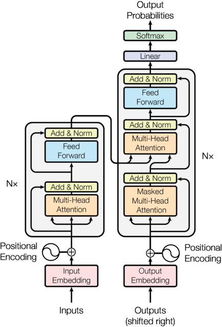 |    | 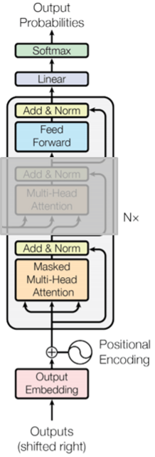

Descriptions for different aspects of the transformer model can be found here:

* [LLM Basics: Embedding Spaces—Transformer Token Vectors Are Not Points in Space (Nicky Pochinkov, 2023)](https://www.greaterwrong.com/posts/pHPmMGEMYefk9jLeh/llm-basics-transformer-token-vectors-are-not-points-in-space)
* [Transformer’s Encoder-Decoder (Shibuya, 2021)](https://kikaben.com/transformers-encoder-decoder/)

The transformer models differ in size and in the algorithms used to connect
the layers of the model. The parameters of a model are often described in a
model card. The LLama2 model is described in this
[Llama2 Model Card](https://github.com/facebookresearch/llama/blob/main/MODEL_CARD.md).

The transformers library can also show the basic structure of a model:
```python
from transformers import LlamaForCausalLM
LlamaForCausalLM.from_pretrained('7b')

LlamaForCausalLM(
  (model): LlamaModel(
    (embed_tokens): Embedding(32000, 4096)
    (layers): ModuleList(
      (0-31): 32 x LlamaDecoderLayer(
        (self_attn): LlamaAttention(
          (q_proj): Linear(in_features=4096, out_features=4096, bias=False)
          (k_proj): Linear(in_features=4096, out_features=4096, bias=False)
          (v_proj): Linear(in_features=4096, out_features=4096, bias=False)
          (o_proj): Linear(in_features=4096, out_features=4096, bias=False)
          (rotary_emb): LlamaRotaryEmbedding()
        )
        (mlp): LlamaMLP(
          (gate_proj): Linear(in_features=4096, out_features=11008, bias=False)
          (up_proj): Linear(in_features=4096, out_features=11008, bias=False)
          (down_proj): Linear(in_features=11008, out_features=4096, bias=False)
          (act_fn): SiLUActivation()
        )
        (input_layernorm): LlamaRMSNorm()
        (post_attention_layernorm): LlamaRMSNorm()
      )
    )
    (norm): LlamaRMSNorm()
  )
  (lm_head): Linear(in_features=4096, out_features=32000, bias=False)
)
```

Decoder Block
=============
From an implementation point of view, most parts of the model can be
handled like a black box. Since the weights are pre-trained for the
involved algorithms, not much can be changed for an inference run.

The de-embedding step back to the vocabulary is done via the language
modelling head `lm_head`. For pre-training this head is exchanged with
a classification head.

The transformer is trained using gradient descent with respect to some loss function.
See: [An overview of gradient descent optimization algorithms (Ruder, 2017)](https://arxiv.org/pdf/1609.04747.pdf)

Each projection to and from an embedded space in the model involves a
[matrix multiplication](https://en.wikipedia.org/wiki/Matrix_multiplication).
For a matrix multiplication, the number of columns in the first matrix
(the dimension) must be equal to the number of rows in the second matrix.
The resulting matrix has the number of rows of the first and the number
of columns of the second matrix. So these projections are used to change
between the embedding dimension and the hidden dimensions of the model.

The matrix multiplications are the most expensive operations of the
transformer model. They can be offloaded to the tensor cores of GPUs
to speed up training & inference. For example this is done using
[CUDA](https://en.wikipedia.org/wiki/CUDA) libraries with instructions
like [SGEMM](https://github.com/NervanaSystems/maxas/wiki/SGEMM)
to speed up matrix multiplications.

When GPUs are involved the size of the model becomes more important,
because the model-data has to fit into the memory of the cards.
For this reason projects like [llama.cpp](https://github.com/ggerganov/llama.cpp)
use quantized versions of the models, where the weights are encoded
in 4-bit integers or even less bits, instead of using float16/float32
values.

Self-Attention
==============
The Transformer uses a "Scaled Dot-Product Attention" to calculate the
distance between a key vector for the current position and the query
vectors for each preceding position in the context window
(see the [original transformer paper](https://arxiv.org/pdf/1706.03762.pdf#figure.2)).
This works similar to the cosine_similarity example for the embedding
vectors shown above.

Attention is the only place where a model looks at the other tokens from
the input sequence. The vectors alone do not take the position of the
preceding tokens into account. This is done by an additional positional
encoding that adds information about the relative distance between the
current token and the preceding tokens to the key and query vectors
(see [Positional Encoding](#positional-encoding) section below).
The arithmetic on these vectors then also takes the distance between
the tokens into account.

A good explaination of the basic self-attention process can be found in
[The Illustrated GPT-2](http://jalammar.github.io/illustrated-gpt2/).

The embedding vector of each token is used to get the query, key and
value vectors Q, K and V of the same dimension. These vectors are projections
from the learned model matrices `wq`, `wk` & `wv` which are distinct
for each token and each layer. When Q, K, and V all come from the same
source token, this is called self-attention (the original transformer was
developed for text-translation, where the key and value vectors could come
from a separate encoder source).

* the Query vector Q is a representation of the current token used
  to score against the key vectors of all the preceding tokens.
  Only the query vector Q of the currently processed token is used in each
  transformer step.
* the Key vectors K are like labels for all the preceding tokens.
  They are matched against in the search for relevant tokens. Multiplying
  the query vector by the key vector produces a score.
* the Value vectors V are actual token representations. Once it is
  scored how relevant each preceding token is, these values are multiplied
  by the probability of the scores and added up to build the representation
  vector for the current token.

Lookup by Query Vector                      | => | Results in Value Vectors weighted by score
--------------------------------------------|:--:|-------------------------------------------
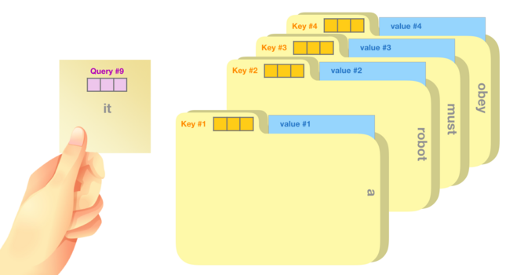 |    | 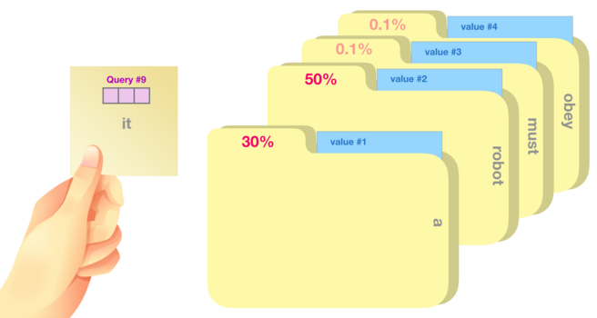

The scores from the start of the context window up to the position of the
current token are called attention vector. The attention vector is converted
to probabilities using `softmax` before the value vectors are processed.
Leftward positions up to the context window size are ignored (or masked out).

```c
memset(out, 0, k_size * sizeof(float));

for (int t = 0; t <= pos; t++) {
    float *k = &key[t * k_size]; // key vector for position
    float score = 0.0f;
    for (int i = 0; i < k_size; i++) {
        score += query[i] * k[i]; // dot product of query and key
    }
    att[t] = score / sqrt(k_size); // scale
}
softmax(att, pos + 1);
for (int t = 0; t <= pos; t++) {
    float *v = &value[t * k_size]; // value vector for position
    for (int i = 0; i < k_size; i++) {
        out[i] += att[t] * v[i]; // accumulate weighted value
    }
}
```

Here is an illustration showing the changing attention on differents parts
of an input sentence from an older paper on [Long Short-Term Memory-Networks (2016)](https://arxiv.org/pdf/1601.06733.pdf#figure.caption.1):

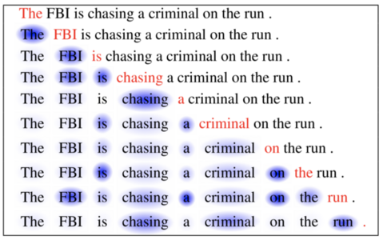

When this example is used to examine the attention vectors used in the
LLama2 model, the results look a little different. Since LLama2 uses tokens
instead of full words and has multiple layers and heads, this can only be
a snapshot of one part of the model. The attention vectors for layer-0/head-0
still shows lower probabilities for the words "is", "a", "on" and the "F" from
FBI. So they are less relevant when the result is calculated. It also shows the
change of probabilities for preceding tokens when the next token is queried:

```python
# run llama2_7b.bin -s 1 -t 0.0 -i "The FBI is chasing a criminal on the" -m generate_attention
         <s>: A[0,0]:[ 1.0000]
         The: A[0,0]:[ 0.9835,  0.0165]
           F: A[0,0]:[ 0.5245,  0.0171,  0.4584]
          BI: A[0,0]:[ 0.1878,  0.0222,  0.5940,  0.1960]
          is: A[0,0]:[ 0.4877,  0.0171,  0.2030,  0.0670,  0.2251]
          ch: A[0,0]:[ 0.2248,  0.0290,  0.1739,  0.0966,  0.2709,  0.2049]
       asing: A[0,0]:[ 0.1346,  0.0388,  0.1617,  0.1120,  0.2573,  0.2921,  0.0037]
           a: A[0,0]:[ 0.2931,  0.0197,  0.0959,  0.0447,  0.1295,  0.1049,  0.0035,  0.3087]
    criminal: A[0,0]:[ 0.1018,  0.0297,  0.0832,  0.0539,  0.0998,  0.1088,  0.0058,  0.4922,  0.0247]
          on: A[0,0]:[ 0.1838,  0.0187,  0.0921,  0.0416,  0.1101,  0.0874,  0.0067,  0.2776,  0.0207,  0.1613]
         the: A[0,0]:[ 0.2390,  0.0136,  0.0679,  0.0337,  0.0799,  0.0547,  0.0066,  0.1241,  0.0165,  0.1074,  0.2566]
         run: A[0,0]:[ 0.0743,  0.0157,  0.0431,  0.0300,  0.0603,  0.0431,  0.0148,  0.0767,  0.0189,  0.1219,  0.3458,  0.1554]
                       The      F        BI       is       ch       asing    a        criminal on       the      run      .
```

Multi-Head Attention
====================
LLama uses `n_heads` heads for the attention calculation (32 for LLama2-7b).
This splits the Q, K and V vectors in 32 parts (of dimension 4096/32=128),
which can run in in parallel. The resulting vectors are merged to a single
result again, after the multi-head attention for a layer completed.

The results are mapped back from the attention representation to an embedding
vector with the learned `wo` transformation from the model.

Scaled Dot-Product Attention                             | => | Multi-Head Attention
---------------------------------------------------------|:--:|-------------------------------------------
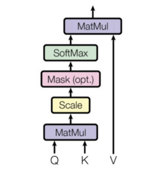 |    | 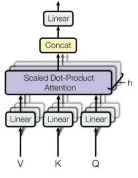

* [Are Sixteen Heads Really Better than One? (Michel et al., 2019)](https://arxiv.org/pdf/1905.10650.pdf)
* [Fast Transformer Decoding: One Write-Head is All You Need (Shazeer, 2019)](https://arxiv.org/pdf/1911.02150.pdf)
* [GQA: Training Generalized Multi-Query Transformer Models from Multi-Head Checkpoints (Ainslie et al., 2023)](https://arxiv.org/pdf/2305.13245.pdf)

The bigger LLama2-70b model uses Grouped Query Attention (GQA). This
reuses key & value weights in the attention layers, and reduces the
size of the model.
* the count of GQA groups per layer is equal to the number of key & value
  matrices per head. The number of query matrices does not change.
* Llama2-70b applies the same number of groups across all layers.
  (4 key/value groups with 8 query matrices each).
* this is the `n_kv_heads` parameter in [llama2.c](run.c)

Positional Encoding
===================
The embedding vector for each token represents a point in an n-dimensional
space of size `dim`. The transformer projects this vector into a representation
vector of the same size with `dim/2` (x, y) tuples, which can be interpreted
as points in a 2-dimensional coordinate system. These are the key & query
vectors projected from the `wk` & `wq` matrices used in [Self-Attention](#self-attention),

The original transformer uses sine and cosine functions of different frequencies
for positional encoding. These positional values are in the range [-1:1].
The values at the end of the position vector converge to (x=1, y=0). The values
at the start of the position vector are more spread out for higher positions
in the context window.

```python
# run llama2_7b.bin -m position -n 8
 0: cos:[ 1.0000,  1.0000,  1.0000,  1.0000,  1.0000, ...,  1.0000,  1.0000,  1.0000,  1.0000,  1.0000]
 0: sin:[ 0.0000,  0.0000,  0.0000,  0.0000,  0.0000, ...,  0.0000,  0.0000,  0.0000,  0.0000,  0.0000]
 1: cos:[ 0.5403,  0.5441,  0.5478,  0.5515,  0.5552, ...,  1.0000,  1.0000,  1.0000,  1.0000,  1.0000]
 1: sin:[ 0.8415,  0.8390,  0.8366,  0.8342,  0.8317, ...,  0.0001,  0.0001,  0.0001,  0.0001,  0.0001]
 2: cos:[-0.4161, -0.4080, -0.3998, -0.3916, -0.3835, ...,  1.0000,  1.0000,  1.0000,  1.0000,  1.0000]
 2: sin:[ 0.9093,  0.9130,  0.9166,  0.9201,  0.9236, ...,  0.0002,  0.0002,  0.0002,  0.0002,  0.0002]
 3: cos:[-0.9900, -0.9880, -0.9858, -0.9835, -0.9810, ...,  1.0000,  1.0000,  1.0000,  1.0000,  1.0000]
 3: sin:[ 0.1411,  0.1544,  0.1677,  0.1808,  0.1938, ...,  0.0003,  0.0003,  0.0003,  0.0003,  0.0003]
 4: cos:[-0.6536, -0.6671, -0.6803, -0.6933, -0.7059, ...,  1.0000,  1.0000,  1.0000,  1.0000,  1.0000]
 4: sin:[-0.7568, -0.7449, -0.7329, -0.7207, -0.7083, ...,  0.0004,  0.0004,  0.0004,  0.0004,  0.0004]
 5: cos:[ 0.2837,  0.2621,  0.2405,  0.2188,  0.1972, ...,  1.0000,  1.0000,  1.0000,  1.0000,  1.0000]
 5: sin:[-0.9589, -0.9650, -0.9707, -0.9758, -0.9804, ...,  0.0005,  0.0005,  0.0005,  0.0005,  0.0005]
 6: cos:[ 0.9602,  0.9523,  0.9438,  0.9346,  0.9249, ...,  1.0000,  1.0000,  1.0000,  1.0000,  1.0000]
 6: sin:[-0.2794, -0.3052, -0.3306, -0.3556, -0.3803, ...,  0.0006,  0.0006,  0.0006,  0.0006,  0.0006]
 7: cos:[ 0.7539,  0.7742,  0.7936,  0.8121,  0.8298, ...,  1.0000,  1.0000,  1.0000,  1.0000,  1.0000]
 7: sin:[ 0.6570,  0.6330,  0.6085,  0.5835,  0.5580, ...,  0.0007,  0.0007,  0.0007,  0.0007,  0.0007]
```

The original transformer uses absolute positional encoding and adds the
position information to the values of the reprensentation vector. So
these values would appear on a circle around the original (x,y) tuples.
See: [The Illustrated Transformer (Jay Alammar, 2019)](http://jalammar.github.io/illustrated-transformer/)

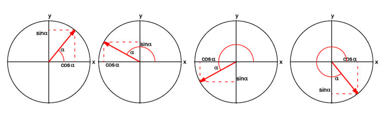

LLama uses Rotary Position Embeddings (RoPE).

RoPE, encodes absolute positional information with a rotation matrix and
naturally incorporates explicit relative position dependency. This also
locates the (x, y) tuples on a circle.

According to the paper one property of rope is long-term decay when the
relative position increases. So a pair of tokens with a long relative
distance should have less connection.
See: [RoFormer: Enhanced transformer with Rotaty Position Embedding (Su et al., 2021)](https://arxiv.org/pdf/2104.09864v4.pdf):

<table><tr><td> Original positional encoding </td><td> RoPE encoding (2d-matrix rotation) </td></tr><tr><td>

```c
q[i]   = v0 + cos(val);
q[i+1] = v1 + sin(val);
```

</td><td>

```c
q[i]   = v0 * cos(val) - v1 * sin(val);
q[i+1] = v0 * sin(val) + v1 * cos(val);
```

</td></tr></table>

For (x, y) tuples further away from the start of the representation vector,
the points on the circle are more spread out when the position in the
context window increases (see color gradient for the first 8 tuples of the
representation vector at different positions in the example below).

Rope Example for single Tupel                                | Rope Embedding (from RoFormer paper)
-------------------------------------------------------------|----------------------------------------------------
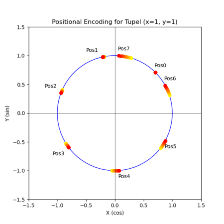 | 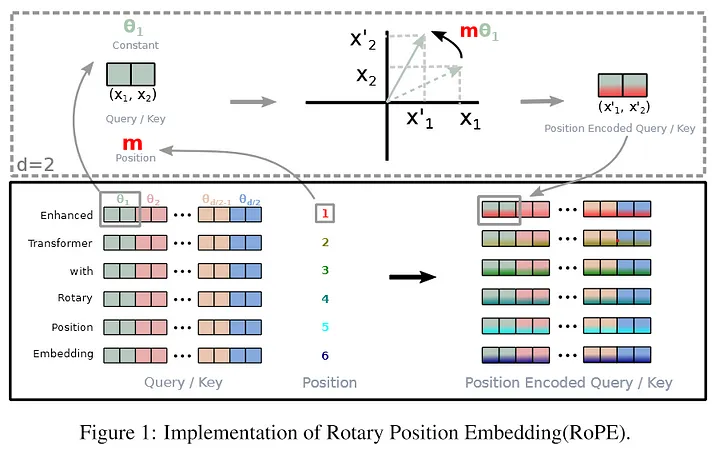

When the attention score is calculated, the position encoding is part of
the (x, y) tuples in the `key` and `query` vectors. The attention multiplies
the tuple values at the same offset in the `key` and `query` vectors,
so the 'spread' of the position information at each offset should be similar.

Because of the residual connection between the layers, where the input is
added again to the output of the attention, the positional information does
not dominate the results.

Feed-Forward Network (FFN)
==========================
The transformer model alternates between multi-head attention, and what it calls
"position-wise feed-forward networks" (FFN). The FFN takes a vector x (the hidden
representation at a particular position in the sequence) and passes it through
two learned linear transformations. An activation function is applied between
the two linear transformations.
See: [GLU Variants Improve Transformer (Shazeer, 2020)](https://arxiv.org/pdf/2002.05202.pdf)

For LLama2-7b the dimension `hidden_dim` of the vectors used in the activation is 11008.
The projection into the hidden dimension is done with the `w1` & `w3` matrices from
the model. The transformation back is done with `w2`.

* The activation function used in LLama and PaLM is [Swish-Gated Linear Unit) (SwiGLU) (2023)](https://www.ai-contentlab.com/2023/03/swishglu-activation-function.html)
* The original transformer paper used a [Rectified-Linear Unit (ReLU) (2011)](https://proceedings.mlr.press/v15/glorot11a/glorot11a.pdf) activation.
* The GPT-2 & BERT transformers used a [Gaussian Error Linear Unit (GELU) (2016)](https://arxiv.org/pdf/1606.08415.pdf)

SwiGLU is a combination of the Swish and the Gated Linear Units (GLU)
activation functions.

ReLU & GELU                      | SwiGLU
---------------------------------|----------------------------
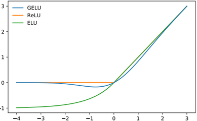 | 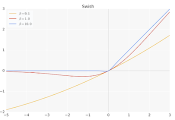

Layer Normalization
===================
Layer normalization ensures that the inputs for each layer are always within
a consistent range, which is supposed to speed up and stabilize the training
process. The values of the matrix are shifted to have a mean of zero and
scaled to have a unit variance of zero.

<table><tr><td> RMSNorm performance </td><td> Code compared </td></tr><tr><td>

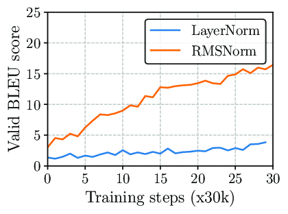

</td><td>

```c
LayerNorm:
  o[j] = weight[j] * ((x[j] - mean) / sqrt(variance + eps));
```
```c
RMSNorm:
  o[j] = weight[j] * (x[j] / sqrt(mean_square + eps));
```

</td></tr></table>

* LLama uses [Root Mean Square Layer Normalization (RMSNorm) (Zhang and Sennrich, 2019)](https://arxiv.org/pdf/1910.07467.pdf)
* The original transformer paper used [Layer Normalization (LayerNorm) (2016)](https://arxiv.org/pdf/1607.06450.pdf)
* The [RMSNorm](https://github.com/bzhangGo/rmsnorm) python code.

RMSNorm is an extension of LayerNorm. The reason behind using RMSNorm is the
computational overhead in LayerNorm. It simplifies LayerNorm by removing the
mean-centering operation, and achieves comparable performance.

Model Quality
=============
Many [tests](https://ai.meta.com/llama/) and openly available datasets like
[MMLU](https://arxiv.org/abs/2009.03300) are used to benchmark the quality of
a model. One of the most basic measurements to compare models is the perplexity.

The perplexity measures how good the model can reproduce parts of a given
subset from the trained data. For the LLama model the perplexity is often
measured against parts of the [WikiText-2 dataset](https://paperswithcode.com/dataset/wikitext-2).
Lower perplexity is better.

* [Perplexity (PPL) of fixed-length Models](https://huggingface.co/docs/transformers/perplexity)
* [Evaluation Metrics for Language Modeling (2019)](https://thegradient.pub/understanding-evaluation-metrics-for-language-models/)
* [A Perplexity Benchmark of llama.cpp (2023)](https://www.xzh.me/2023/09/a-perplexity-benchmark-of-llamacpp.html)


By [Barnim Dzwillo](dzwillo@strato.de), October 2023
